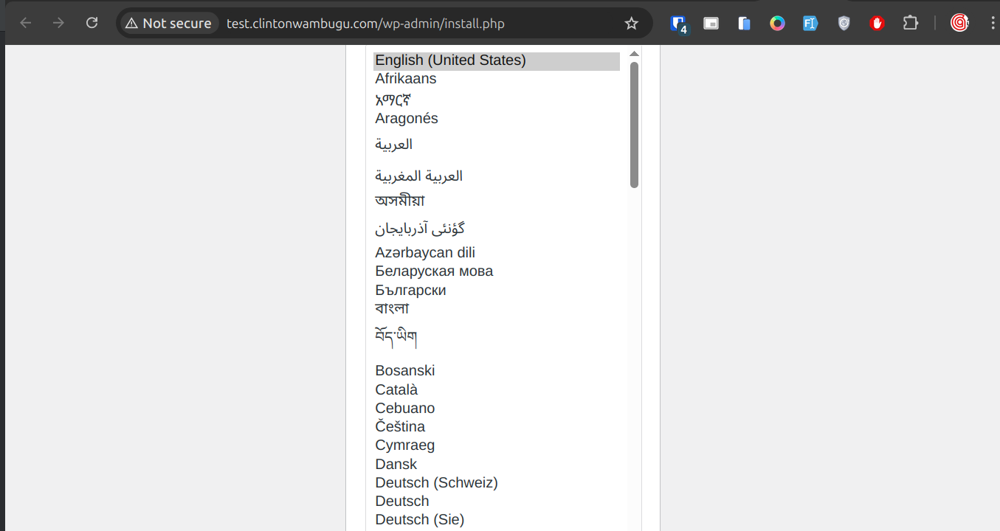

# WordPress Deployment with Nginx & Ansible

This project automates the installation and setup of WordPress with Nginx using Ansible. It configures security keys, sets up the database, and optimizes Nginx for WordPress.

## 🚀 Features

- **Automated WordPress installation**
- **Nginx configuration for optimal performance**
- **Secure `wp-config.php` setup**
- **Customizable variables** for domain, database, and security keys

## 🛠 Prerequisites

Before running the playbook, ensure you have:

- **Ansible installed** – Follow the [Ansible installation guide](https://docs.ansible.com/ansible/latest/installation_guide/intro_installation.html#id11) and use `pipx` for installation: `pipx install --include-deps ansible`. For more information on `pipx`, visit the [pipx documentation](https://pipx.pypa.io/stable/).
- **A Linux server** (Ubuntu/Debian recommended)
- **SSH access** to the server
- **A domain name** pointed to the server
- **inventory.ini** defining the target server

## ⚙️ Setup & Usage

### 1️⃣ Clone the Repository
```sh
git clone https://github.com/your-repo/wordpress-nginx-setup.git
cd wordpress-nginx-setup
```

### 2️⃣ Configure Variables
Edit `/vars/vars.yml` to set:

- **`domain_name`** – Your domain name
- **`db_name`**, **`db_user`**, **`db_password`** – Database credentials
- **Security keys** – Set manually or let the playbook generate them  

### 3️⃣ Run the Playbook
```sh
ansible-playbook wordpress_existing_server_setup.yaml -i inventory.ini --ask-vault-pass
```
#### 🔒 Securing Sensitive Data with Ansible Vault
To prevent exposing credentials in a public repository, store sensitive variables using Ansible Vault.

1️⃣ Encrypting Your Variables File
Run the following command to encrypt your vars.yml file:
```angular2html
ansible-vault encrypt vars/vars.yml
```
You'll be prompted to set a password. This password will be required whenever you need to edit or use the file.

2️⃣ Editing Encrypted Variables
To modify the encrypted vars.yml file:

```angular2html
ansible-vault edit vars/vars.yml
```

3️⃣ Running the Playbook with Vault

Since the file is encrypted, use the --ask-vault-pass flag when running the playbook:

```angular2html
ansible-playbook wordpress_existing_server_setup.yaml -i inventory.ini --ask-vault-pass
```
Alternatively, store the vault password in a file and use:

```angular2html
ansible-playbook wordpress_existing_server_setup.yaml -i inventory.ini --vault-password-file .vault_pass
```
Note: Never commit the .vault_pass file to Git.

4️⃣ Decrypting the File (If Needed)

If you need to decrypt the file permanently:

```angular2html
ansible-vault decrypt vars/vars.yml
```

This ensures that credentials such as db_user, db_password, and db_root_password remain safe while keeping your repository public.

### 4️⃣ Access Your Site
Visit [http://your-domain.com](http://your-domain.com) to complete the setup.  

## 📸 Screenshots

### WordPress Deployment in Action



